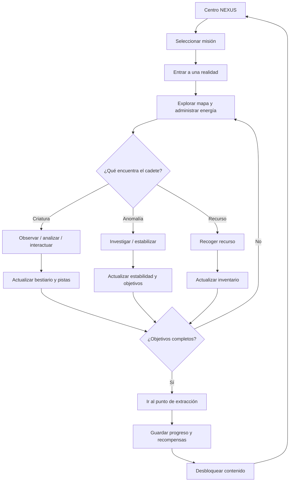
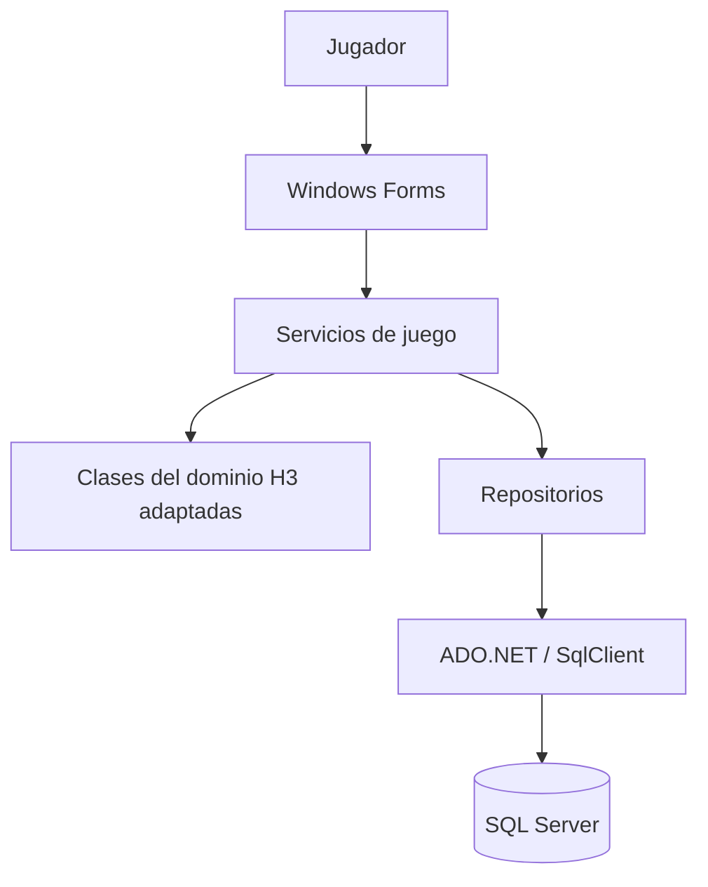
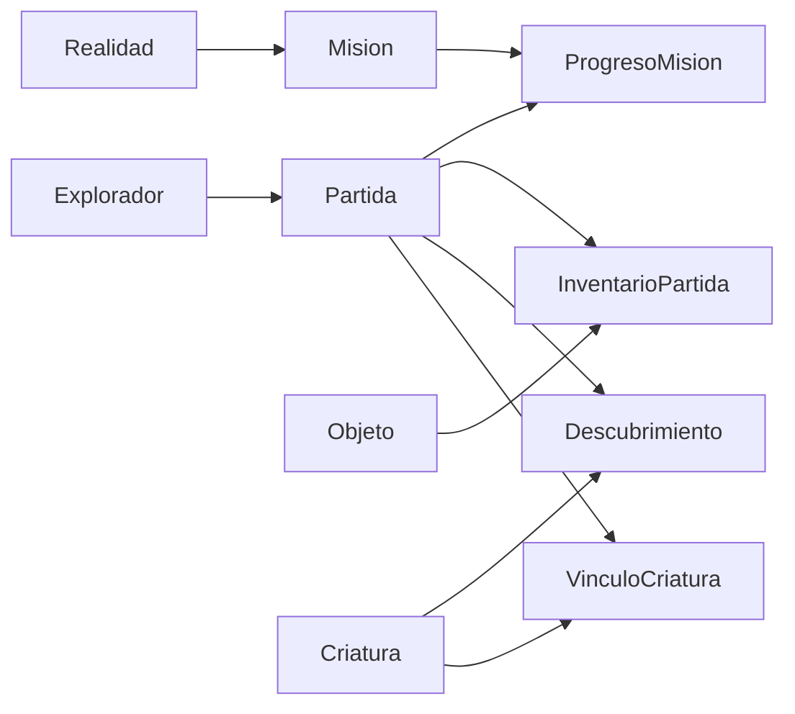

# Diagramas de apoyo de NEXUS

## 1. Ciclo principal

```mermaid
flowchart TD
    A[Centro NEXUS] --> B[Seleccionar misión]
    B --> C[Entrar a una realidad]
    C --> D[Explorar mapa y administrar energía]
    D --> E{¿Qué encuentra el cadete?}
    E -->|Criatura| F[Observar / analizar / interactuar]
    E -->|Anomalía| G[Investigar / estabilizar]
    E -->|Recurso| H[Recoger recurso]
    F --> I[Actualizar bestiario y pistas]
    G --> J[Actualizar estabilidad y objetivos]
    H --> K[Actualizar inventario]
    I --> L{¿Objetivos completos?}
    J --> L
    K --> L
    L -->|No| D
    L -->|Sí| M[Ir al punto de extracción]
    M --> N[Guardar progreso y recompensas]
    N --> O[Desbloquear contenido]
    O --> A
```

## 2. Arquitectura por capas

```mermaid
flowchart TB
    Jugador --> Formularios[Windows Forms]
    Formularios --> Servicios[Servicios de juego]
    Servicios --> Dominio[Clases del dominio H3 adaptadas]
    Servicios --> Repositorios[Repositorios]
    Repositorios --> SqlClient[ADO.NET / SqlClient]
    SqlClient --> SQL[(SQL Server)]
```

## 3. Relación resumida de datos

```mermaid
flowchart LR
    Explorador --> Partida
    Partida --> ProgresoMision
    Mision --> ProgresoMision
    Realidad --> Mision
    Partida --> InventarioPartida
    Objeto --> InventarioPartida
    Partida --> Descubrimiento
    Criatura --> Descubrimiento
    Partida --> VinculoCriatura
    Criatura --> VinculoCriatura
```
